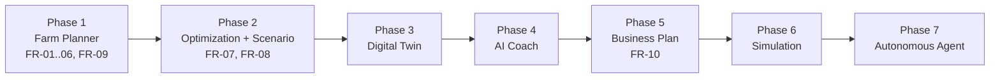

# 01 — Product Requirements Document (PRD)
## FarmPlan Operating System (FPOS)

> Version: 1.0
> Last Updated: 2026-07-04
> Status: Draft
> Owner: Product Manager
> Reads before: `02_DOMAIN_MODEL.md`
> Reads after: `00_MASTER.md`

---

# 1. Purpose

เอกสารนี้แปลง Vision, North Star และ Goals จาก [`00_MASTER.md`](00_MASTER.md)
ให้กลายเป็นความต้องการผลิตภัณฑ์ที่ตรวจสอบได้ (verifiable requirements)

เอกสารนี้ **ไม่นิยาม Entity** — Entity ทั้งหมดถูกนิยามที่
[`02_DOMAIN_MODEL.md`](02_DOMAIN_MODEL.md) เท่านั้น เอกสารนี้อ้างอิงชื่อ Entity
โดยไม่กำหนดฟิลด์ใหม่

---

# 2. Problem Statement

เกษตรกรรายย่อยส่วนใหญ่ตัดสินใจปลูกพืชหรือเลี้ยงสัตว์จาก

- ประสบการณ์ส่วนตัว
- คำบอกเล่าเพื่อนบ้าน
- ราคาปีที่แล้ว

โดยไม่มีเครื่องมือที่ช่วย

- คำนวณต้นทุนล่วงหน้า
- ประเมินความเสี่ยง
- วางแผนกระแสเงินสดตลอดฤดูกาล
- เปรียบเทียบทางเลือกหลายแบบ

ผลคือรายได้ไม่มั่นคง ขาดทุนจากความผันผวนของราคาและภัยธรรมชาติ และไม่มีข้อมูล
ประกอบการตัดสินใจที่โปร่งใส

---

# 3. Target Users (Personas)

> หลัก **Farmer First** — persona แรกต้องเป็นเกษตรกรรายย่อยเสมอ (ดู `00_MASTER.md` §7)

## 3.1 สมชาย — เกษตรกรรายย่อย (Primary)

- มีที่นา 1–5 ไร่
- เงินทุนจำกัด แรงงานในครัวเรือน
- ใช้สมาร์ตโฟน แต่สัญญาณอินเทอร์เน็ตไม่เสถียร → ต้องรองรับ **Offline Friendly**
- ต้องการรู้ว่า "ปลูกอะไรถึงจะไม่ขาดทุน และเงินจะพอใช้ทั้งฤดูไหม"

## 3.2 มานี — เกษตรกรรุ่นใหม่ / Smart Farmer (Secondary)

- มี 10–100 ไร่ ต้องการเปรียบเทียบหลาย Scenario และวางแผนธุรกิจ

## 3.3 เจ้าหน้าที่ส่งเสริมการเกษตร (Advisor)

- ให้คำปรึกษาเกษตรกรหลายราย ต้องการเครื่องมืออธิบายเหตุผลที่ตรวจสอบย้อนกลับได้

---

# 4. User Stories (Epics)

| ID | ในฐานะ | ฉันต้องการ | เพื่อ |
| --- | --- | --- | --- |
| US-01 | เกษตรกร | บอกขนาดที่ดิน เงินทุน แรงงาน แหล่งน้ำ | ให้ระบบเข้าใจข้อจำกัดของฉัน |
| US-02 | เกษตรกร | ให้ระบบเสนอแผนการใช้พื้นที่ (Land Allocation) | จัดสรรพืช/สัตว์อย่างเหมาะสม |
| US-03 | เกษตรกร | เห็นต้นทุนและผลตอบแทนที่คาดการณ์ | ตัดสินใจได้ว่าคุ้มหรือไม่ |
| US-04 | เกษตรกร | เห็น Cashflow รายเดือน | รู้ว่าเงินจะขาดมือช่วงไหน |
| US-05 | เกษตรกร | เห็นความเสี่ยงของแต่ละแผน | เลือกแผนที่รับความเสี่ยงได้ |
| US-06 | Smart Farmer | สร้างและเปรียบเทียบหลาย Scenario | เลือกทางที่ดีที่สุด |
| US-07 | ทุกคน | ถาม AI แล้วได้คำตอบพร้อมเหตุผลและแหล่งข้อมูล | เชื่อถือคำแนะนำได้ |
| US-08 | Smart Farmer | สร้าง Business Plan | ใช้ยื่นขอสินเชื่อ/นำเสนอ |

---

# 5. Functional Requirements

| ID | Requirement | อ้างอิง Entity (`02`) | Priority (MVP?) |
| --- | --- | --- | --- |
| FR-01 | บันทึกข้อมูลฟาร์มและข้อจำกัด | `Farm`, `Plot`, `WaterSource`, `Resource` | MVP |
| FR-02 | จัดสรรพื้นที่ให้พืช/สัตว์ | `Crop`, `Livestock`, `Plan` | MVP |
| FR-03 | ประเมินต้นทุน | `CostItem`, `Activity` | MVP |
| FR-04 | พยากรณ์รายได้ | `RevenueItem` | MVP |
| FR-05 | สร้างกระแสเงินสดรายเดือน | `CashflowEntry` | MVP |
| FR-06 | วิเคราะห์ความเสี่ยง | `RiskFactor` | MVP |
| FR-07 | จัดการหลาย Scenario | `Scenario`, `Plan` | Phase 2 |
| FR-08 | คำแนะนำจาก AI พร้อมเหตุผล | `Recommendation` | Phase 2 |
| FR-09 | Dashboard สรุปผล | (ดู `07_UI_SPECIFICATION.md`) | MVP |
| FR-10 | สร้าง Business Plan | `Plan`, `Scenario` | Phase 5 |

---

# 6. Non-Functional Requirements

| ID | หมวด | Requirement |
| --- | --- | --- |
| NFR-01 | Explainability | ทุกตัวเลข/คำแนะนำต้องแสดงที่มา สมมติฐาน และระดับความเชื่อมั่น (`00_MASTER.md` §9) |
| NFR-02 | Offline | ฟีเจอร์หลัก (กรอกข้อมูล + คำนวณ) ต้องทำงานได้แบบ offline |
| NFR-03 | Scalable | รองรับ 1–1,000 ไร่ โดยไม่เปลี่ยน Architecture |
| NFR-04 | Modular | ทุกโมดูลพัฒนา/ทดสอบแยกกันได้ |
| NFR-05 | Performance | การ optimize แผน 1 ไร่ต้องเสร็จภายในไม่กี่วินาทีบนอุปกรณ์ทั่วไป |
| NFR-06 | Localization | ภาษาไทยเป็นหลัก รองรับหน่วยไทย (ไร่ งาน ตารางวา) |
| NFR-07 | Trust | AI ห้ามกุข้อมูลพืช/สัตว์/ราคา (`00_MASTER.md` §9) |

---

# 7. MVP Scope vs. Roadmap

สอดคล้องกับ Roadmap ใน [`00_MASTER.md`](00_MASTER.md) §16

**MVP (Phase 1)** = FR-01 ถึง FR-06 + FR-09 พร้อมหลัก Explainability ครบทุกตัวเลข

---

# 8. Success Metrics

ยึดตาม Success Criteria ใน [`00_MASTER.md`](00_MASTER.md) §8

| Metric | เป้าหมาย MVP |
| --- | --- |
| สร้างแผนฟาร์มอัตโนมัติได้ | ✅ จากข้อมูลฟาร์ม 1 ไร่ |
| วิเคราะห์ต้นทุน/กำไร/ความเสี่ยงได้ | ✅ ครบสามด้าน |
| สร้าง Cashflow รายเดือนได้ | ✅ |
| ทุกข้อเสนอมีคำอธิบายเหตุผล | ✅ 100% ของคำแนะนำ |
| Deploy ใช้งานจริงได้ | ✅ (ดู `11_DEPLOYMENT.md`) |

---

# 9. Assumptions & Constraints

- ข้อมูลพืช/สัตว์/ราคาต้องมาจาก Knowledge Base ([`05_KNOWLEDGE_BASE.md`](05_KNOWLEDGE_BASE.md)) ที่มีแหล่งอ้างอิง
- เมื่อข้อมูลขาด ระบบต้อง state assumption และให้ผู้ใช้ override ได้ (`00_MASTER.md` §9)
- ระบบเป็นผู้ช่วยตัดสินใจ ไม่ใช่ผู้ตัดสินใจแทน (Human in Control)

---

# 10. Out of Scope

ตาม [`00_MASTER.md`](00_MASTER.md) §6 — Commodity Trading, Real-time Market Prediction,
Weather Prediction Model, Autonomous Robotics, Precision Agriculture Hardware

---

# 11. Cross Reference

- Vision & rules: [`00_MASTER.md`](00_MASTER.md)
- Entities used above: [`02_DOMAIN_MODEL.md`](02_DOMAIN_MODEL.md)
- How requirements are optimized: [`04_OPTIMIZATION_ENGINE.md`](04_OPTIMIZATION_ENGINE.md)
- Screens implementing these stories: [`07_UI_SPECIFICATION.md`](07_UI_SPECIFICATION.md)
- Acceptance tests: [`10_TEST_PLAN.md`](10_TEST_PLAN.md)
