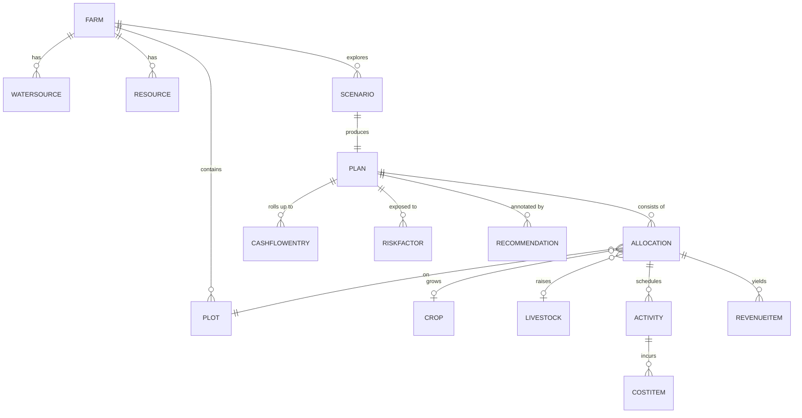

# 02 — Domain Model
## FarmPlan Operating System (FPOS)

> Version: 1.0
> Last Updated: 2026-07-04
> Status: Draft
> Owner: Chief Architect
> Priority: Canonical — **Single Source of Truth for all Entities**

---

# 1. Purpose & Authority

เอกสารนี้เป็น **แหล่งนิยาม Entity เพียงที่เดียว** ของทั้งระบบ FPOS ตามกฎ
[`00_MASTER.md`](00_MASTER.md) §10 ("ห้ามชื่อ Entity ซ้ำ / ห้าม Logic ซ้ำหลายไฟล์")

เอกสารอื่นทุกฉบับ — Database, API, UI, Optimization, Agent — **ต้องอ้างอิงชื่อและฟิลด์
จากที่นี่** และห้ามนิยาม Entity ใหม่ หากต้องการเพิ่ม/แก้ Entity ต้องแก้ที่ไฟล์นี้ก่อน

ระดับของเอกสารนี้เป็น **conceptual / logical model** (ไม่ผูกกับฐานข้อมูลใดฐานข้อมูลหนึ่ง)
การแปลงเป็นตารางจริงอยู่ที่ [`03_DATABASE.md`](03_DATABASE.md)

---

# 2. Entity Relationship Diagram

---

# 3. Core Entities

> หมายเหตุ: ทุก Entity มี `id` (identifier) และ audit fields (`created_at`, `updated_at`)
> โดยปริยาย จะไม่ระบุซ้ำในทุกตาราง

## 3.1 Farm — ฟาร์ม

หน่วยระดับบนสุด แทนฟาร์มหนึ่งแห่งของผู้ใช้หนึ่งราย

| Field | Type | Description |
| --- | --- | --- |
| `id` | ID | รหัสฟาร์ม |
| `name` | string | ชื่อฟาร์ม |
| `owner_name` | string | ชื่อเจ้าของ/ผู้ใช้ |
| `location` | string | ที่ตั้ง (ตำบล/อำเภอ/จังหวัด) |
| `total_area_rai` | number | พื้นที่รวม (ไร่) |
| `latitude` | number? | พิกัด (optional) |
| `longitude` | number? | พิกัด (optional) |

## 3.2 Plot — แปลง/ที่ดินย่อย

พื้นที่ย่อยภายใน Farm ที่จัดสรรได้แยกกัน

| Field | Type | Description |
| --- | --- | --- |
| `id` | ID | รหัสแปลง |
| `farm_id` | ref Farm | อยู่ในฟาร์มใด |
| `name` | string | ชื่อ/รหัสแปลง |
| `area_rai` | number | ขนาด (ไร่) |
| `soil_type` | enum | ประเภทดิน (clay/loam/sandy/…) |
| `water_access` | enum | การเข้าถึงน้ำ (rainfed/irrigated/mixed) |

## 3.3 Crop — พืช (จาก Knowledge Base)

ชนิดพืชที่เลือกปลูกได้ ข้อมูลอ้างอิงมาจาก
[`05_KNOWLEDGE_BASE.md`](05_KNOWLEDGE_BASE.md) — ห้าม AI กุข้อมูล (`00_MASTER.md` §9)

| Field | Type | Description |
| --- | --- | --- |
| `id` | ID | รหัสพืช |
| `name_th` | string | ชื่อพืช (ไทย) |
| `name_en` | string | ชื่อพืช (อังกฤษ) |
| `cycle_days` | number | รอบการปลูก (วัน) |
| `yield_per_rai` | number | ผลผลิตต่อไร่ (ประมาณ) |
| `water_need_level` | enum | ความต้องการน้ำ (low/medium/high) |
| `season` | enum | ฤดูที่เหมาะสม |
| `data_source` | string | แหล่งอ้างอิงข้อมูล |

## 3.4 Livestock — สัตว์ (จาก Knowledge Base)

| Field | Type | Description |
| --- | --- | --- |
| `id` | ID | รหัสสัตว์ |
| `name_th` | string | ชื่อสัตว์ (ไทย) |
| `name_en` | string | ชื่อสัตว์ (อังกฤษ) |
| `cycle_days` | number | รอบการเลี้ยง (วัน) |
| `yield_type` | enum | ผลผลิต (meat/egg/milk/…) |
| `feed_need_level` | enum | ความต้องการอาหาร (low/medium/high) |
| `data_source` | string | แหล่งอ้างอิงข้อมูล |

## 3.5 WaterSource — แหล่งน้ำ

| Field | Type | Description |
| --- | --- | --- |
| `id` | ID | รหัสแหล่งน้ำ |
| `farm_id` | ref Farm | อยู่ในฟาร์มใด |
| `type` | enum | ประเภท (well/pond/canal/rain/tap) |
| `capacity_m3` | number? | ความจุโดยประมาณ (ลบ.ม.) |
| `reliability` | enum | ความแน่นอน (high/medium/low) |

## 3.6 Resource — ทรัพยากร (เงินทุน/แรงงาน/เวลา)

ข้อจำกัดที่ใช้เป็น Constraint ในการ optimize (ดู [`04_OPTIMIZATION_ENGINE.md`](04_OPTIMIZATION_ENGINE.md))

| Field | Type | Description |
| --- | --- | --- |
| `id` | ID | รหัสทรัพยากร |
| `farm_id` | ref Farm | อยู่ในฟาร์มใด |
| `type` | enum | ประเภท (capital/labor/time) |
| `amount` | number | ปริมาณที่มี |
| `unit` | string | หน่วย (บาท / คน-วัน / ชั่วโมง) |

## 3.7 Scenario — สถานการณ์จำลอง

ชุดสมมติฐาน+ข้อจำกัดหนึ่งชุด ที่นำไปสร้าง Plan หนึ่งแผน

| Field | Type | Description |
| --- | --- | --- |
| `id` | ID | รหัส Scenario |
| `farm_id` | ref Farm | อยู่ในฟาร์มใด |
| `name` | string | ชื่อ Scenario เช่น "เน้นความมั่นคง" |
| `risk_appetite` | enum | ระดับความเสี่ยงที่ยอมรับ (low/medium/high) |
| `assumptions` | text | สมมติฐาน (ราคา, สภาพอากาศ ฯลฯ) |

## 3.8 Plan — แผนการผลิต

ผลลัพธ์ของการ optimize สำหรับ Scenario หนึ่ง ประกอบด้วย Allocation หลายรายการ

| Field | Type | Description |
| --- | --- | --- |
| `id` | ID | รหัสแผน |
| `scenario_id` | ref Scenario | สร้างจาก Scenario ใด |
| `status` | enum | สถานะ (draft/optimized/accepted) |
| `objective_value` | number | ค่าของ Objective Function |
| `expected_income` | number | รายได้คาดการณ์รวม |
| `risk_score` | number | คะแนนความเสี่ยงรวม |

## 3.9 Allocation — การจัดสรร

การจับคู่ระหว่าง Plot กับ Crop หรือ Livestock ภายใน Plan (Land Allocation)

| Field | Type | Description |
| --- | --- | --- |
| `id` | ID | รหัสการจัดสรร |
| `plan_id` | ref Plan | อยู่ในแผนใด |
| `plot_id` | ref Plot | บนแปลงใด |
| `crop_id` | ref Crop? | ปลูกพืชใด (ถ้าเป็นพืช) |
| `livestock_id` | ref Livestock? | เลี้ยงสัตว์ใด (ถ้าเป็นสัตว์) |
| `area_rai` | number | พื้นที่ที่จัดสรร (ไร่) |
| `quantity` | number? | จำนวน (สำหรับสัตว์) |

## 3.10 Activity — กิจกรรม

งานที่ต้องทำในแต่ละ Allocation (เตรียมดิน/ปลูก/ให้ปุ๋ย/เก็บเกี่ยว) — ตัวขับต้นทุนและเวลา

| Field | Type | Description |
| --- | --- | --- |
| `id` | ID | รหัสกิจกรรม |
| `allocation_id` | ref Allocation | อยู่ในการจัดสรรใด |
| `name` | string | ชื่อกิจกรรม |
| `start_day` | number | เริ่มวันที่เท่าไรของรอบ |
| `duration_days` | number | ระยะเวลา (วัน) |
| `labor_need` | number | แรงงานที่ต้องใช้ (คน-วัน) |

## 3.11 CostItem — รายการต้นทุน

| Field | Type | Description |
| --- | --- | --- |
| `id` | ID | รหัสต้นทุน |
| `activity_id` | ref Activity | เกิดจากกิจกรรมใด |
| `category` | enum | หมวด (seed/fertilizer/labor/water/equipment/other) |
| `amount` | number | จำนวนเงิน (บาท) |
| `is_estimate` | boolean | เป็นค่าประมาณหรือข้อเท็จจริง (`00_MASTER.md` §9) |

## 3.12 RevenueItem — รายการรายได้

| Field | Type | Description |
| --- | --- | --- |
| `id` | ID | รหัสรายได้ |
| `allocation_id` | ref Allocation | มาจากการจัดสรรใด |
| `expected_yield` | number | ผลผลิตคาดการณ์ |
| `unit_price` | number | ราคาต่อหน่วย (บาท) |
| `amount` | number | รายได้รวมคาดการณ์ (บาท) |
| `is_estimate` | boolean | เป็นค่าประมาณ (มักเป็น true) |
| `price_source` | string | แหล่งอ้างอิงราคา |

## 3.13 CashflowEntry — รายการกระแสเงินสด

สรุปเงินเข้า/ออกรายเดือนของ Plan

| Field | Type | Description |
| --- | --- | --- |
| `id` | ID | รหัสรายการ |
| `plan_id` | ref Plan | อยู่ในแผนใด |
| `month` | number | เดือนที่ (1..N ของรอบ) |
| `inflow` | number | เงินเข้า (บาท) |
| `outflow` | number | เงินออก (บาท) |
| `net` | number | สุทธิ (inflow − outflow) |
| `cumulative` | number | ยอดสะสม |

## 3.14 RiskFactor — ปัจจัยความเสี่ยง

| Field | Type | Description |
| --- | --- | --- |
| `id` | ID | รหัสความเสี่ยง |
| `plan_id` | ref Plan | ผูกกับแผนใด |
| `type` | enum | ประเภท (price/weather/pest/water/market) |
| `likelihood` | enum | โอกาสเกิด (low/medium/high) |
| `impact` | enum | ผลกระทบ (low/medium/high) |
| `mitigation` | text | แนวทางลดความเสี่ยง |

## 3.15 Recommendation — คำแนะนำจาก AI

ทุกคำแนะนำต้องมีเหตุผลและระดับความเชื่อมั่น ตาม AI Contract (`00_MASTER.md` §9)

| Field | Type | Description |
| --- | --- | --- |
| `id` | ID | รหัสคำแนะนำ |
| `plan_id` | ref Plan | เกี่ยวกับแผนใด |
| `message` | text | ข้อความคำแนะนำ |
| `reasoning` | text | เหตุผล (why) |
| `assumptions` | text | สมมติฐานที่ใช้ |
| `confidence` | enum | ระดับความเชื่อมั่น (low/medium/high) |
| `data_sources` | string[] | แหล่งข้อมูลที่อ้างอิง |

---

# 4. Enumerations (ค่าคงที่ที่ใช้ร่วมกัน)

| Enum | ค่าที่เป็นไปได้ |
| --- | --- |
| `soil_type` | clay, loam, sandy, silt, mixed |
| `water_access` | rainfed, irrigated, mixed |
| `resource.type` | capital, labor, time |
| `risk_appetite` | low, medium, high |
| `plan.status` | draft, optimized, accepted |
| `cost.category` | seed, fertilizer, labor, water, equipment, other |
| `risk.type` | price, weather, pest, water, market |
| `confidence` | low, medium, high |

---

# 5. Glossary — อภิธานศัพท์

| คำ | ความหมาย |
| --- | --- |
| ไร่ (rai) | หน่วยพื้นที่ไทย = 1,600 ตร.ม. |
| Allocation | การจับคู่แปลงกับพืช/สัตว์หนึ่งรายการในแผน |
| Objective Function | ฟังก์ชันเป้าหมายที่ Optimization Engine ทำให้เหมาะสม (ดู `04`) |
| Constraint | ข้อจำกัด เช่น พื้นที่ เงินทุน แรงงาน น้ำ เวลา |
| Scenario vs Plan | Scenario = ชุดสมมติฐาน; Plan = ผลลัพธ์ที่ optimize แล้วของ Scenario นั้น |
| is_estimate | ธงบอกว่าตัวเลขเป็นค่าประมาณ เพื่อแยก fact ออกจาก estimate |

---

# 6. Cross Reference

- Rules governing this file: [`00_MASTER.md`](00_MASTER.md) §10
- Requirements that use these entities: [`01_PRD.md`](01_PRD.md)
- Physical schema of these entities: [`03_DATABASE.md`](03_DATABASE.md)
- Constraints & objective built on these: [`04_OPTIMIZATION_ENGINE.md`](04_OPTIMIZATION_ENGINE.md)
- Crop/Livestock/price provenance: [`05_KNOWLEDGE_BASE.md`](05_KNOWLEDGE_BASE.md)
- API resources for these entities: [`06_API_SPECIFICATION.md`](06_API_SPECIFICATION.md)
