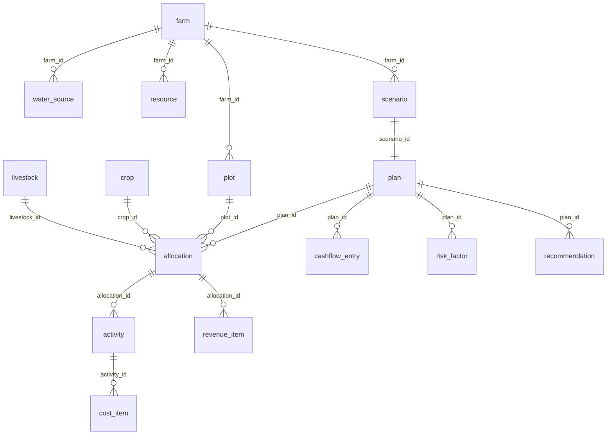

# 03 — Database Design
## FarmPlan Operating System (FPOS)

> Version: 1.0
> Last Updated: 2026-07-04
> Status: Draft
> Owner: Data Engineer

---

# 1. Purpose

เอกสารนี้แปลง Entity เชิงตรรกะจาก [`02_DOMAIN_MODEL.md`](02_DOMAIN_MODEL.md)
ให้เป็น **schema ฐานข้อมูลเชิงกายภาพ** โดย **ไม่นิยาม Entity หรือฟิลด์ใหม่** —
ทุกฟิลด์อ้างอิงจาก `02` เท่านั้น (`00_MASTER.md` §10)

---

# 2. Storage Strategy (Offline Friendly)

ตามหลัก **Offline Friendly** และ **Scalable** ใน [`00_MASTER.md`](00_MASTER.md) §7

- **Local-first:** ใช้ **SQLite** บนอุปกรณ์ผู้ใช้ เพื่อให้กรอกข้อมูลและคำนวณได้แบบ offline
- **Sync (optional):** เมื่อออนไลน์ ซิงก์ขึ้น **PostgreSQL** ฝั่ง server
- Schema เดียวกันทั้งสองฝั่ง (เลือกชนิดข้อมูลที่พกพาข้าม engine ได้)
- ทุกตารางมี `id`, `created_at`, `updated_at`; รองรับ `sync_status` สำหรับ conflict resolution

---

# 3. Physical ER Diagram



---

# 4. Tables

ตารางทั้งหมด map 1:1 กับ Entity ใน `02`. คอลัมน์ตรงกับฟิลด์ใน `02` — ที่นี่เพิ่ม
เฉพาะรายละเอียดกายภาพ (PK/FK/index/nullability)

| Table | Maps to Entity (`02`) | Primary Key | Foreign Keys |
| --- | --- | --- | --- |
| `farm` | Farm | `id` | — |
| `plot` | Plot | `id` | `farm_id → farm.id` |
| `crop` | Crop | `id` | — (ข้อมูลจาก Knowledge Base) |
| `livestock` | Livestock | `id` | — (ข้อมูลจาก Knowledge Base) |
| `water_source` | WaterSource | `id` | `farm_id → farm.id` |
| `resource` | Resource | `id` | `farm_id → farm.id` |
| `scenario` | Scenario | `id` | `farm_id → farm.id` |
| `plan` | Plan | `id` | `scenario_id → scenario.id` |
| `allocation` | Allocation | `id` | `plan_id`, `plot_id`, `crop_id?`, `livestock_id?` |
| `activity` | Activity | `id` | `allocation_id → allocation.id` |
| `cost_item` | CostItem | `id` | `activity_id → activity.id` |
| `revenue_item` | RevenueItem | `id` | `allocation_id → allocation.id` |
| `cashflow_entry` | CashflowEntry | `id` | `plan_id → plan.id` |
| `risk_factor` | RiskFactor | `id` | `plan_id → plan.id` |
| `recommendation` | Recommendation | `id` | `plan_id → plan.id` |

## 4.1 Constraint บน allocation

`allocation` ต้องอ้าง **crop_id หรือ livestock_id อย่างใดอย่างหนึ่ง** (ไม่ทั้งคู่, ไม่ว่างทั้งคู่)
บังคับด้วย CHECK constraint:

```sql
CHECK (
  (crop_id IS NOT NULL AND livestock_id IS NULL)
  OR
  (crop_id IS NULL AND livestock_id IS NOT NULL)
)
```

---

# 5. Indexes

| Index | Table(s) | เหตุผล |
| --- | --- | --- |
| FK indexes | ทุก FK column | เร่ง join (plan→allocation→activity→cost_item) |
| `idx_cashflow_plan_month` | `cashflow_entry(plan_id, month)` | ดึง cashflow เรียงเดือนเร็ว |
| `idx_alloc_plan` | `allocation(plan_id)` | สร้าง/แสดงแผนเร็ว |
| `idx_recommendation_plan` | `recommendation(plan_id)` | ดึงคำแนะนำต่อแผน |

---

# 6. Data Provenance Fields

ตาม AI Contract (`00_MASTER.md` §9) — แยก fact ออกจาก estimate และเก็บที่มา

- `cost_item.is_estimate`, `revenue_item.is_estimate` → บอกว่าเป็นค่าประมาณ
- `revenue_item.price_source`, `crop.data_source`, `livestock.data_source` → แหล่งอ้างอิง
- `recommendation.data_sources` → เก็บเป็น JSON array (SQLite: TEXT; PostgreSQL: JSONB)

---

# 7. Migration & Seeding

- Migration แบบเวอร์ชัน (เช่น numbered SQL files) เก็บใน [`/database`](database/)
- ข้อมูลตั้งต้นของ `crop` / `livestock` มาจาก [`05_KNOWLEDGE_BASE.md`](05_KNOWLEDGE_BASE.md)
  พร้อม `data_source` ทุกแถว — **ห้าม seed ข้อมูลที่ไม่มีแหล่งอ้างอิง**

---

# 8. Cross Reference

- Entity definitions (authoritative): [`02_DOMAIN_MODEL.md`](02_DOMAIN_MODEL.md)
- Who reads/writes these tables: [`06_API_SPECIFICATION.md`](06_API_SPECIFICATION.md)
- Source of crop/livestock rows: [`05_KNOWLEDGE_BASE.md`](05_KNOWLEDGE_BASE.md)
- Migration files location: [`/database`](database/)
