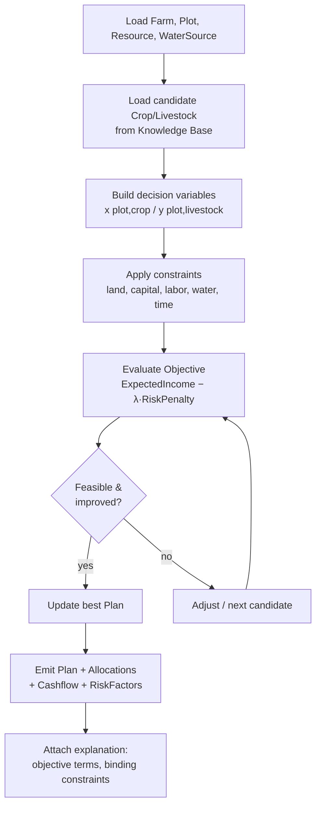

# 04 — Optimization Engine
## FarmPlan Operating System (FPOS)

> Version: 1.0
> Last Updated: 2026-07-04
> Status: Draft
> Owner: Optimization Engineer

---

# 1. Purpose

Optimization Engine คือหัวใจที่แปลงข้อจำกัดของฟาร์มให้เป็น **Plan** ที่เหมาะสมที่สุด
โดยยึดตาม **North Star** ใน [`00_MASTER.md`](00_MASTER.md) §2:

> เป้าหมายคือ **รายได้ที่มั่นคงภายใต้ความเสี่ยงที่ยอมรับได้** — ไม่ใช่กำไรสูงสุดเสมอไป

Engine ทำงานบน Entity ที่นิยามใน [`02_DOMAIN_MODEL.md`](02_DOMAIN_MODEL.md) เท่านั้น

---

# 2. Objective Function

เราไม่ maximize กำไรดิบ แต่ maximize **utility ที่ปรับด้วยความเสี่ยง** (risk-adjusted)

```
maximize  U(Plan) = ExpectedIncome − λ · RiskPenalty
```

โดย

- `ExpectedIncome` = ผลรวมของ `RevenueItem.amount` − ผลรวมของ `CostItem.amount`
- `RiskPenalty` = ฟังก์ชันของ `RiskFactor` (likelihood × impact) ในแผน
- `λ` (lambda) = ค่าความไม่ชอบความเสี่ยง (risk aversion) ที่มาจาก
  `Scenario.risk_appetite` — appetite ต่ำ → λ สูง (ระวังมาก), appetite สูง → λ ต่ำ

ผลลัพธ์เก็บใน `Plan.objective_value`, `Plan.expected_income`, `Plan.risk_score`

> **Transparency (§9):** ทุกเทอมในสมการต้องแสดงต่อผู้ใช้ได้ พร้อมค่าที่ใช้จริง

---

# 3. Decision Variables

| ตัวแปร | ความหมาย | อ้างอิง Entity |
| --- | --- | --- |
| `x[plot, crop]` | จัดสรรกี่ไร่ของ Plot ให้ Crop | `Allocation.area_rai` |
| `y[plot, livestock]` | จำนวนสัตว์ที่เลี้ยงบน Plot | `Allocation.quantity` |
| การเลือก Activity/ช่วงเวลา | ตารางกิจกรรมของแต่ละ Allocation | `Activity` |

---

# 4. Constraints

ข้อจำกัดทั้งหมดมาจาก `Resource`, `Plot`, `WaterSource` ใน `02`

| Constraint | คำอธิบาย |
| --- | --- |
| **พื้นที่ (Land)** | ผลรวม `area_rai` ที่จัดสรรบนแต่ละ Plot ≤ `Plot.area_rai` |
| **เงินทุน (Capital)** | ผลรวม `CostItem.amount` ≤ `Resource(type=capital).amount` |
| **แรงงาน (Labor)** | ความต้องการแรงงานต่อช่วงเวลา ≤ `Resource(type=labor).amount` |
| **น้ำ (Water)** | ความต้องการน้ำรวม (จาก `Crop.water_need_level`) ≤ กำลังของ `WaterSource` |
| **เวลา (Time)** | กิจกรรมต้องอยู่ในรอบฤดูกาลและไม่ชนกันเกินกำลังแรงงาน |
| **ความเสี่ยง (Risk cap)** | `Plan.risk_score` ≤ เพดานตาม `Scenario.risk_appetite` |

---

# 5. Optimization Flow



---

# 6. Solver Approach

- **MVP:** heuristic / greedy + local search ที่อธิบายได้ (เหมาะกับ 1–10 ไร่, offline, เร็ว)
- **Phase 2:** Linear/Mixed-Integer Programming (เช่น LP/MILP) สำหรับฟาร์มใหญ่ขึ้น
- ทุกวิธีต้องคืน **binding constraints** (ข้อจำกัดที่ถูกใช้เต็ม) เพื่อใช้ในการอธิบาย

เลือกวิธีตามหลัก **Explainability ก่อน performance** — ห้ามใช้กล่องดำที่อธิบายไม่ได้

---

# 7. Explainability of Results

ตาม [`00_MASTER.md`](00_MASTER.md) §9 ทุก Plan ที่ engine คืนต้องมาพร้อม:

1. **ทำไมจัดสรรแบบนี้** — ค่าของแต่ละเทอมใน Objective
2. **อะไรคือข้อจำกัดที่กำหนดผล** — binding constraints (เช่น "น้ำเต็มเพดาน")
3. **สมมติฐาน** — ราคา/ผลผลิตที่ใช้ พร้อม `is_estimate` และแหล่งอ้างอิง
4. **ทางเลือก** — เสนออย่างน้อยแผน "มั่นคง" คู่กับแผน "กำไรสูง/เสี่ยง" (§2)

ข้อมูลนี้ถูกเขียนลง `Recommendation` (ดู `02` §3.15) เพื่อให้ Agent/UI นำไปแสดง

---

# 8. Multi-Scenario

แต่ละ `Scenario` (ต่าง `risk_appetite`/`assumptions`) ให้ `Plan` ของตัวเอง
ระบบเปรียบเทียบได้หลาย Plan พร้อมกัน (ดู [`07_UI_SPECIFICATION.md`](07_UI_SPECIFICATION.md) — Scenario Compare)

---

# 9. Cross Reference

- North Star (why risk-adjusted): [`00_MASTER.md`](00_MASTER.md) §2, §9
- Entities & fields used: [`02_DOMAIN_MODEL.md`](02_DOMAIN_MODEL.md)
- Candidate crop/livestock data: [`05_KNOWLEDGE_BASE.md`](05_KNOWLEDGE_BASE.md)
- How Agent surfaces explanations: [`08_AGENT_SYSTEM.md`](08_AGENT_SYSTEM.md)
- Validation of optimizer output: [`10_TEST_PLAN.md`](10_TEST_PLAN.md)
