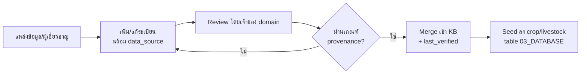

# 05 — Knowledge Base
## FarmPlan Operating System (FPOS)

> Version: 1.0
> Last Updated: 2026-07-04
> Status: Draft
> Owner: Data Engineer + Agronomist + Livestock Specialist

---

# 1. Purpose

Knowledge Base (KB) คือ **แหล่งข้อมูลข้อเท็จจริง** ด้านพืช สัตว์ และราคา ที่ระบบใช้อ้างอิง
ตาม AI Contract ใน [`00_MASTER.md`](00_MASTER.md) §9:

> AI **ห้ามกุ** ข้อมูลพืช สัตว์ ราคา หรือสถิติ — ทุกค่าต้องมี **แหล่งอ้างอิง (provenance)**

KB จ่ายข้อมูลให้ Entity `Crop`, `Livestock` และราคาใน `RevenueItem`
(นิยามที่ [`02_DOMAIN_MODEL.md`](02_DOMAIN_MODEL.md)) — KB **ไม่นิยาม Entity ใหม่**

---

# 2. Knowledge Domains

| Domain | เนื้อหา | เจ้าของความรู้ (`00_MASTER.md` §11) |
| --- | --- | --- |
| Crop Knowledge | รอบปลูก ผลผลิต/ไร่ ความต้องการน้ำ ฤดู | Agronomist |
| Livestock Knowledge | รอบเลี้ยง ชนิดผลผลิต ความต้องการอาหาร | Livestock Specialist |
| Price Knowledge | ราคาตลาดอ้างอิง (ช่วง/ค่ากลาง) | Economist |
| Cost Norms | ต้นทุนมาตรฐานต่อกิจกรรม | Economist |

---

# 3. Data Schema (Knowledge Records)

ทุกระเบียนความรู้เป็น **fact record** ที่มีที่มา ไม่ใช่ค่าที่โมเดลเดาเอง

```yaml
# ตัวอย่างโครงสร้าง crop knowledge record
id: crop_rice_rd6
name_th: "ข้าว กข6"
name_en: "Rice RD6"
cycle_days: 120          # value
yield_per_rai: 650       # value, หน่วย กก./ไร่
water_need_level: high
season: wet
data_source: "อ้างอิง: กรมการข้าว (ตัวอย่าง placeholder)"
confidence: medium
last_verified: 2026-07-04
```

> ค่าตัวเลขทั้งหมดข้างบนเป็น **placeholder ตัวอย่างโครงสร้าง** — ต้องแทนที่ด้วยข้อมูลจริง
> ที่มีแหล่งอ้างอิงก่อนใช้งานจริง

## 3.1 Required fields ของทุกระเบียน

| Field | เหตุผล |
| --- | --- |
| `data_source` | บังคับ — ไม่มีแหล่งอ้างอิง = ไม่รับเข้า KB |
| `confidence` | ระดับความเชื่อมั่น (low/medium/high) |
| `last_verified` | วันที่ตรวจสอบล่าสุด |

---

# 4. Provenance & Citation Rules

1. ทุกระเบียนต้องมี `data_source` — ห้ามข้อมูลกำพร้า (orphan data)
2. เมื่อ AI ใช้ค่าจาก KB ต้อง **cite** แหล่งนั้นในผลลัพธ์ (`Recommendation.data_sources`)
3. เมื่อ **ไม่มี** ข้อมูลใน KB → AI ต้อง **state assumption + confidence ต่ำ** และให้ผู้ใช้ override
   (ตาม `00_MASTER.md` §9) — ห้ามเดาแล้วนำเสนอเป็นข้อเท็จจริง
4. แยก **fact** (มีแหล่ง) ออกจาก **estimate** (ค่าประมาณ) ด้วย `confidence` และ flag `is_estimate`
   ในระดับ `CostItem`/`RevenueItem`

---

# 5. Update Process



---

# 6. Retrieval for AI (RAG)

KB ถูกใช้เป็นแหล่ง retrieval ของ Agent (ดู [`08_AGENT_SYSTEM.md`](08_AGENT_SYSTEM.md)) —
Agent ดึงเฉพาะระเบียนที่เกี่ยวข้องมาประกอบคำตอบ และต้องอ้างอิงกลับทุกครั้ง

---

# 7. Storage Location

- ไฟล์ความรู้ตั้งต้น (YAML/CSV) เก็บใน [`/knowledge`](knowledge/)
- ถูก seed เข้าตาราง `crop` / `livestock` ตาม [`03_DATABASE.md`](03_DATABASE.md) §7

---

# 8. Cross Reference

- AI Contract (no fabrication): [`00_MASTER.md`](00_MASTER.md) §9
- Entities fed by KB: [`02_DOMAIN_MODEL.md`](02_DOMAIN_MODEL.md) (Crop, Livestock, RevenueItem)
- Seeding into DB: [`03_DATABASE.md`](03_DATABASE.md)
- Consumed by agents (RAG): [`08_AGENT_SYSTEM.md`](08_AGENT_SYSTEM.md)
- Knowledge files: [`/knowledge`](knowledge/)
