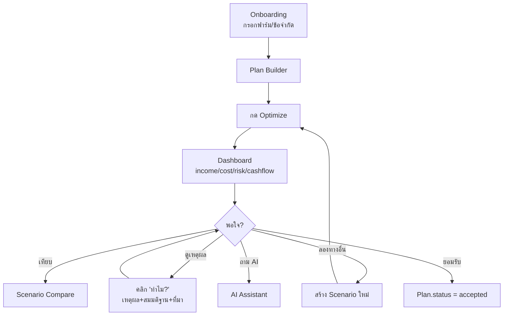

# 07 — UI Specification
## FarmPlan Operating System (FPOS)

> Version: 1.0
> Last Updated: 2026-07-04
> Status: Draft
> Owner: Frontend Engineer

---

# 1. Purpose

กำหนดหน้าจอ ผังการใช้งาน และหลัก UX ที่นำ User Stories จาก [`01_PRD.md`](01_PRD.md)
มาสู่สายตาผู้ใช้ โดยแสดงข้อมูลจาก Entity ใน [`02_DOMAIN_MODEL.md`](02_DOMAIN_MODEL.md)
ผ่าน API ใน [`06_API_SPECIFICATION.md`](06_API_SPECIFICATION.md)

UI **ไม่นิยาม Entity ใหม่** — เป็นการนำเสนอ (presentation) เท่านั้น

---

# 2. UX Principles (จาก `00_MASTER.md` §7)

| หลักการ | ผลต่อ UI |
| --- | --- |
| **Farmer First** | ภาษาไทยง่าย ปุ่มใหญ่ ไอคอนชัด ลดศัพท์เทคนิค |
| **Explainability** | ทุกตัวเลขมีปุ่ม "ทำไม?" เปิดดูเหตุผล/สมมติฐาน/ที่มา |
| **Human in Control** | AI เสนอ ผู้ใช้กด "ยอมรับ/ปรับ/ปฏิเสธ" เสมอ |
| **Offline Friendly** | แสดงสถานะ online/offline และคิว sync |

---

# 3. Screen Inventory

| Screen | User Story (`01`) | ข้อมูลหลักที่แสดง (`02`) |
| --- | --- | --- |
| Onboarding / Farm Setup | US-01 | Farm, Plot, WaterSource, Resource |
| Plan Builder | US-02, US-03 | Allocation, Crop/Livestock, CostItem, RevenueItem |
| Cashflow View | US-04 | CashflowEntry (รายเดือน) |
| Risk View | US-05 | RiskFactor |
| Scenario Compare | US-06 | หลาย Plan เทียบกัน |
| AI Assistant (Chat) | US-07 | Recommendation |
| Dashboard | FR-09 | สรุป income/cost/risk/cashflow |
| Business Plan Export | US-08 | Plan + Scenario (Phase 5) |

---

# 4. Primary User Flow

---

# 5. Key Components

## 5.1 Explain Panel ("ทำไม?")

คอมโพเนนต์กลางที่ผูกกับทุกตัวเลข แสดงเนื้อหาจาก `Recommendation`:
- **reasoning** (why) · **assumptions** · **confidence** (badge สี) · **data_sources** (ลิงก์ KB)

บังคับตาม AI Contract (`00_MASTER.md` §9) — ไม่มีตัวเลขไหนแสดงโดยไม่มีทางกดดูที่มา

## 5.2 Cashflow Chart

กราฟแท่ง inflow/outflow รายเดือน + เส้น `cumulative` จาก `CashflowEntry`
ไฮไลต์เดือนที่ `cumulative < 0` (เงินขาดมือ)

## 5.3 Risk Matrix

ตาราง likelihood × impact จาก `RiskFactor` (สีเขียว→แดง) + คอลัมน์ mitigation

## 5.4 Scenario Compare Table

เทียบหลาย `Plan`: expected_income, risk_score, objective_value เคียงกัน — สื่อ trade-off
"มั่นคง vs กำไรสูง" ตาม North Star (`00_MASTER.md` §2)

---

# 6. Offline & Localization

- แสดง badge สถานะเชื่อมต่อ และจำนวนรายการรอ sync
- ฟีเจอร์กรอกข้อมูล + optimize ทำงานได้ขณะ offline
- หน่วยไทย: ไร่/งาน/ตารางวา, สกุลเงินบาท, วันที่แบบไทย

---

# 7. Accessibility

- คอนทราสต์สูง อ่านง่ายกลางแดด (ใช้งานในไร่นา)
- รองรับหน้าจอมือถือเป็นหลัก (mobile-first)
- ปุ่มการกระทำหลักเข้าถึงได้ด้วยนิ้วโป้ง (thumb reach)

---

# 8. Cross Reference

- Stories realized here: [`01_PRD.md`](01_PRD.md)
- Data shown: [`02_DOMAIN_MODEL.md`](02_DOMAIN_MODEL.md)
- Data fetched via: [`06_API_SPECIFICATION.md`](06_API_SPECIFICATION.md)
- AI content in Explain Panel/Chat: [`08_AGENT_SYSTEM.md`](08_AGENT_SYSTEM.md)
- UI code location: [`/ui`](ui/)
