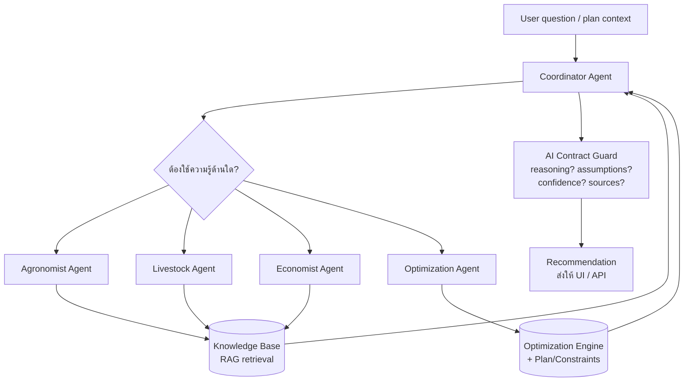
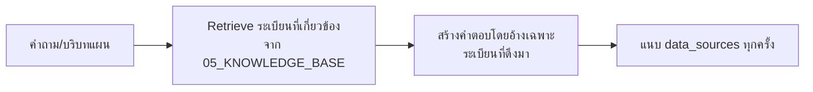

# 08 — Agent System
## FarmPlan Operating System (FPOS)

> Version: 1.0
> Last Updated: 2026-07-04
> Status: Draft
> Owner: AI Engineer

---

# 1. Purpose

กำหนดสถาปัตยกรรม AI Agent ที่ทำหน้าที่ **แนะนำ อธิบาย และตอบคำถาม** ผู้ใช้
โดยบังคับใช้ **AI Contract** ใน [`00_MASTER.md`](00_MASTER.md) §9 เป็นกฎพฤติกรรม

Agent ทำงานบน Entity ใน [`02_DOMAIN_MODEL.md`](02_DOMAIN_MODEL.md), ใช้ผลจาก
[`04_OPTIMIZATION_ENGINE.md`](04_OPTIMIZATION_ENGINE.md) และ retrieval จาก
[`05_KNOWLEDGE_BASE.md`](05_KNOWLEDGE_BASE.md) — **ไม่กุข้อมูลเอง**

---

# 2. Agent Roles

Map กับ AI Roles ใน [`00_MASTER.md`](00_MASTER.md) §11 (แต่ละ role เป็น specialist agent)

| Agent | หน้าที่ | ใช้ข้อมูลจาก |
| --- | --- | --- |
| Agronomist Agent | คำแนะนำด้านพืช | KB (crop) |
| Livestock Agent | คำแนะนำด้านสัตว์ | KB (livestock) |
| Economist Agent | ต้นทุน/ราคา/ตลาด | KB (price, cost norms) |
| Optimization Agent | อธิบายผล optimize | Engine (`04`), binding constraints |
| Coordinator Agent | จัดวงสนทนา รวมคำตอบ ตรวจ AI Contract | ทุก agent |

---

# 3. Architecture

---

# 4. Recommendation Engine

ทุกผลลัพธ์ของ Agent ถูกทำให้อยู่ในรูป Entity `Recommendation` (`02` §3.15) ซึ่ง **บังคับ** ให้มี:

- `message` — คำแนะนำ
- `reasoning` — เหตุผล (why)
- `assumptions` — สมมติฐานที่ใช้
- `confidence` — low/medium/high
- `data_sources` — แหล่งอ้างอิง (KB records)

หากฟิลด์บังคับใดขาด → **AI Contract Guard บล็อกไม่ให้ส่งออก**

---

# 5. RAG over Knowledge Base

- Agent **ตอบได้เฉพาะ** จากระเบียนที่ retrieve มา + ผลจาก Engine
- ถ้า retrieve ไม่พบ → ต้องบอกว่า "ไม่มีข้อมูล" + ระบุ assumption + confidence ต่ำ
  (ตาม `05_KNOWLEDGE_BASE.md` §4 และ `00_MASTER.md` §9)

---

# 6. AI Contract Guard (บังคับใช้ §9)

ชั้นตรวจสอบก่อนส่งคำตอบใด ๆ ออกจากระบบ:

| ตรวจ | ต้องเป็น |
| --- | --- |
| explain reasoning | มี `reasoning` ไม่ว่าง |
| expose assumptions | มี `assumptions` เมื่อมีการประมาณ |
| separate fact/estimate | ตัวเลขประมาณต้อง flag `is_estimate` |
| confidence level | มี `confidence` |
| cite source | มี `data_sources` เมื่อใช้ข้อมูล KB |
| no fabrication | ทุกค่าข้อเท็จจริงต้อง trace กลับ KB ได้ |
| respect constraints | ไม่เสนอสิ่งที่ละเมิด constraint ใน `04` |

---

# 7. Human in Control

Agent **เสนอ** เท่านั้น การตัดสินใจสุดท้าย (`Plan.status = accepted`) เป็นของผู้ใช้เสมอ
(`00_MASTER.md` §7) — ทุกคำแนะนำมีทางเลือก "ปรับ/ปฏิเสธ" ใน UI (`07`)

---

# 8. Entry Point

Agent ถูกเรียกผ่าน `/assistant/ask` ใน [`06_API_SPECIFICATION.md`](06_API_SPECIFICATION.md)
และผลแสดงใน Explain Panel / AI Assistant ของ [`07_UI_SPECIFICATION.md`](07_UI_SPECIFICATION.md)

---

# 9. Cross Reference

- AI Contract (authoritative): [`00_MASTER.md`](00_MASTER.md) §9
- Recommendation entity: [`02_DOMAIN_MODEL.md`](02_DOMAIN_MODEL.md) §3.15
- Optimizer explanations: [`04_OPTIMIZATION_ENGINE.md`](04_OPTIMIZATION_ENGINE.md) §7
- Knowledge retrieval rules: [`05_KNOWLEDGE_BASE.md`](05_KNOWLEDGE_BASE.md)
- Prompts location: [`/prompts`](prompts/) · Agent code: [`/agents`](agents/)
