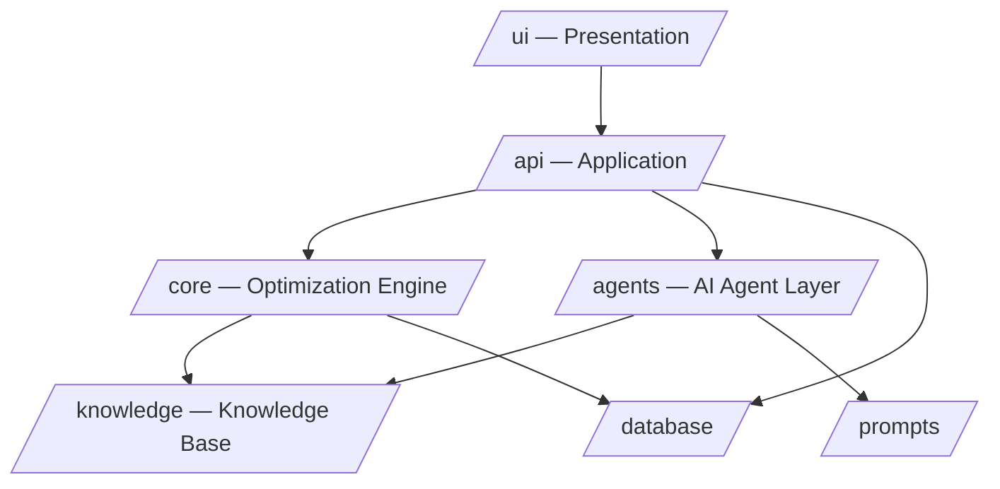

# 09 — Engineering Standard
## FarmPlan Operating System (FPOS)

> Version: 1.0
> Last Updated: 2026-07-04
> Status: Draft
> Owner: Chief Architect + Backend Engineer

---

# 1. Purpose

กำหนดมาตรฐานวิศวกรรมที่ทำให้ FPOS เป็นไปตาม Engineering Philosophy ใน
[`00_MASTER.md`](00_MASTER.md) §15: Simple · Explainable · Modular · Reliable ·
Maintainable · AI-Friendly · Production Ready

---

# 2. Module Boundaries

โครงสร้างโมดูลตาม System Architecture (`00_MASTER.md` §12) และ Repository Structure §14

**กฎ:** โมดูลชั้นบนเรียกชั้นล่างได้ ห้ามเรียกย้อนขึ้น (no upward dependency)
แต่ละโมดูลพัฒนา/ทดสอบแยกได้ (**Modular**, §7 `00_MASTER.md`)

---

# 3. Coding Standards

| หัวข้อ | มาตรฐาน |
| --- | --- |
| ภาษา/รูปแบบ | ใช้ formatter + linter อัตโนมัติต่อภาษา, บังคับใน CI |
| ชื่อ Entity | ใช้ชื่อจาก [`02_DOMAIN_MODEL.md`](02_DOMAIN_MODEL.md) เท่านั้น — ห้ามตั้งชื่อซ้ำ/ต่าง |
| Logic ซ้ำ | ห้าม logic ซ้ำหลายที่ (`00_MASTER.md` §10) — สกัดเป็นฟังก์ชันร่วมใน `/core` |
| ความเรียบง่าย | เลือกวิธีที่อธิบายได้ก่อนวิธีที่ซับซ้อน (**Explainable > clever**) |
| ความคิดเห็น | อธิบาย "ทำไม" ไม่ใช่ "อะไร"; โค้ดควรอ่านรู้เรื่องเอง |
| Error handling | คืน error model มาตรฐานตาม [`06_API_SPECIFICATION.md`](06_API_SPECIFICATION.md) §6 |

---

# 4. Explainability as a Code Requirement

ตาม AI Contract (`00_MASTER.md` §9) — เป็นข้อบังคับระดับโค้ด ไม่ใช่แค่ UI:

- ฟังก์ชันที่คืนค่าคำนวณ (ต้นทุน/รายได้/ความเสี่ยง) ต้องคืน **ที่มาและสมมติฐาน** คู่กับตัวเลข
- ค่าประมาณต้อง flag `is_estimate` ตั้งแต่ชั้น core ไม่ใช่ค่อยเติมภายหลัง
- ห้าม hardcode ข้อมูลพืช/สัตว์/ราคาในโค้ด — ต้องมาจาก Knowledge Base (`05`)

---

# 5. Documentation Conventions (บังคับทุกไฟล์ `.md`)

ตาม Repository Rules ([`00_MASTER.md`](00_MASTER.md) §10) ทุกเอกสารต้องมี:

- [x] Markdown + heading เป็นระบบ
- [x] **Version**
- [x] **Last Updated**
- [x] **Cross Reference** section
- [x] Mermaid diagram เมื่อเหมาะสม
- [x] ไม่มีข้อมูล/Entity/Logic ซ้ำกับไฟล์อื่น (อ้างอิงแทนการทำซ้ำ)

---

# 6. Version Control

- ทุกงานอยู่บน feature branch, merge ผ่าน review
- Commit message สื่อ "ทำไม" ของการเปลี่ยนแปลง
- แก้ Entity ต้องแก้ที่ [`02_DOMAIN_MODEL.md`](02_DOMAIN_MODEL.md) ก่อน แล้วจึงตามด้วยโค้ด/DB

---

# 7. Definition of Done

งานถือว่าเสร็จเมื่อ: ผ่าน lint + test ([`10_TEST_PLAN.md`](10_TEST_PLAN.md)),
มีคำอธิบาย/ที่มาครบตาม §9, เอกสารที่เกี่ยวข้องอัปเดต Version/Last Updated แล้ว

---

# 8. Cross Reference

- Philosophy & rules: [`00_MASTER.md`](00_MASTER.md) §10, §12, §15
- Canonical entities: [`02_DOMAIN_MODEL.md`](02_DOMAIN_MODEL.md)
- Test requirements: [`10_TEST_PLAN.md`](10_TEST_PLAN.md)
- Deployment gates: [`11_DEPLOYMENT.md`](11_DEPLOYMENT.md)
