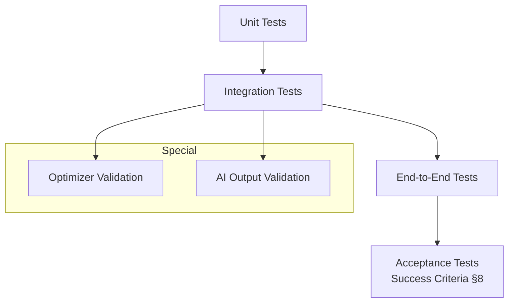

# 10 — Test Plan
## FarmPlan Operating System (FPOS)

> Version: 1.0
> Last Updated: 2026-07-04
> Status: Draft
> Owner: QA

---

# 1. Purpose

กำหนดกลยุทธ์การทดสอบที่พิสูจน์ว่า FPOS ทำได้ตาม **Success Criteria** ใน
[`00_MASTER.md`](00_MASTER.md) §8 และเคารพ **AI Contract** §9

---

# 2. Test Levels

| Level | ขอบเขต |
| --- | --- |
| Unit | ฟังก์ชันคำนวณต้นทุน/รายได้/ความเสี่ยงใน `/core` |
| Integration | API ↔ DB ↔ Engine ↔ Agent |
| End-to-End | flow ผู้ใช้จริง: onboarding → optimize → dashboard |
| Acceptance | ตรงตาม Success Criteria §8 |

---

# 3. Optimizer Validation

ทดสอบ Optimization Engine ([`04_OPTIMIZATION_ENGINE.md`](04_OPTIMIZATION_ENGINE.md))

| Test | เกณฑ์ผ่าน |
| --- | --- |
| Constraint respect | ไม่มี Plan ที่ละเมิด land/capital/labor/water/time |
| North Star | risk_appetite=low ต้องได้ risk_score ต่ำกว่า/เท่ากับ appetite=high |
| Infeasible | ข้อจำกัดที่เป็นไปไม่ได้ → คืน `INFEASIBLE_PLAN` (ไม่ใช่แผนมั่ว) |
| Explainability | ทุก Plan คืน binding constraints + objective terms |
| Determinism | อินพุตเดิม → ผลเดิม (สำหรับ heuristic ที่ fix seed) |

---

# 4. AI Output Validation (บังคับตาม §9)

ทดสอบ Agent ([`08_AGENT_SYSTEM.md`](08_AGENT_SYSTEM.md)) ผ่าน AI Contract Guard

| Test | เกณฑ์ผ่าน |
| --- | --- |
| Has reasoning | ทุก `Recommendation` มี `reasoning` ไม่ว่าง |
| Has assumptions | เมื่อใช้ค่าประมาณ ต้องมี `assumptions` |
| Has confidence | มี `confidence` ทุกครั้ง |
| Cites sources | เมื่ออ้างข้อมูล KB ต้องมี `data_sources` ที่ชี้ไประเบียนจริง |
| No fabrication | ค่าข้อเท็จจริงทุกตัว trace กลับ KB ได้ (ไม่มีค่ากำพร้า) |
| Missing data | เมื่อ KB ไม่มีข้อมูล → ระบุ assumption + confidence ต่ำ ไม่เดาเป็น fact |

---

# 5. Non-Functional Tests

| NFR (`01`) | วิธีทดสอบ |
| --- | --- |
| Offline (NFR-02) | ตัดเน็ต → กรอกข้อมูล + optimize ต้องทำงาน แล้ว sync ภายหลัง |
| Performance (NFR-05) | optimize 1 ไร่ เสร็จภายในไม่กี่วินาทีบนอุปกรณ์ทั่วไป |
| Scalable (NFR-03) | ทดสอบ 1 / 10 / 100 / 1,000 ไร่ ด้วย architecture เดิม |
| Sync conflict | แก้ offline สองที่ → คืน `409 SYNC_CONFLICT` ตาม `06` §6 |

---

# 6. Acceptance — Mapping ต่อ Success Criteria (§8)

| Success Criteria | Acceptance Test |
| --- | --- |
| สร้างแผนฟาร์มอัตโนมัติ | E2E: farm 1 ไร่ → optimize → ได้ Plan |
| วิเคราะห์ต้นทุน/กำไร/ความเสี่ยง | ผลมี CostItem, RevenueItem, RiskFactor ครบ |
| สร้าง Cashflow | ได้ CashflowEntry รายเดือน ยอด cumulative ถูกต้อง |
| หลาย Scenario | สร้าง ≥2 Scenario แล้วเทียบได้ |
| AI อธิบายทุกข้อเสนอ | §4 ผ่านทั้งหมด |
| Deploy ได้จริง | ตาม [`11_DEPLOYMENT.md`](11_DEPLOYMENT.md) |

---

# 7. Regression

ทุกการแก้ Entity ใน [`02_DOMAIN_MODEL.md`](02_DOMAIN_MODEL.md) ต้องรัน regression suite
เต็มก่อน merge — ป้องกัน schema drift ระหว่าง DB/API/UI

---

# 8. Cross Reference

- Criteria being tested: [`00_MASTER.md`](00_MASTER.md) §8, §9
- Requirements/NFRs: [`01_PRD.md`](01_PRD.md)
- Optimizer under test: [`04_OPTIMIZATION_ENGINE.md`](04_OPTIMIZATION_ENGINE.md)
- Agent under test: [`08_AGENT_SYSTEM.md`](08_AGENT_SYSTEM.md)
- Test code location: [`/tests`](tests/)
