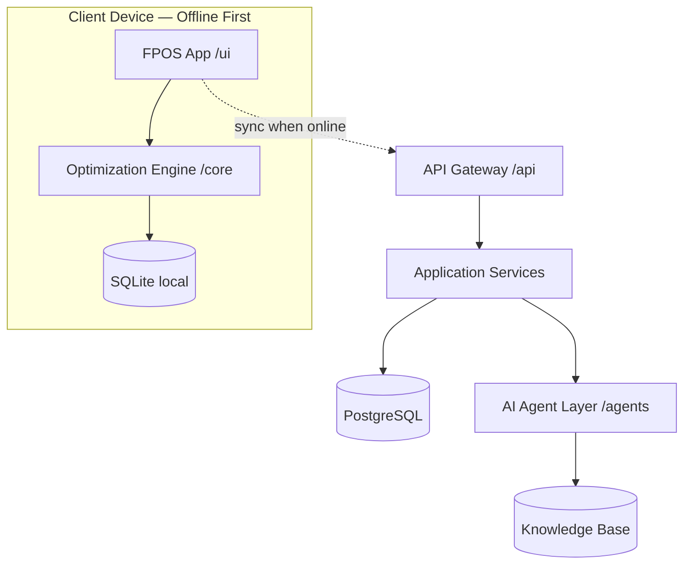
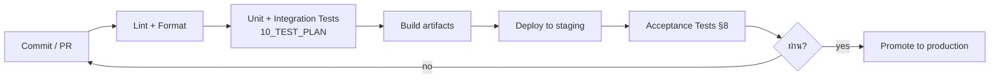

# 11 — Deployment
## FarmPlan Operating System (FPOS)

> Version: 1.0
> Last Updated: 2026-07-04
> Status: Draft
> Owner: Backend Engineer + Chief Architect

---

# 1. Purpose

กำหนดสถาปัตยกรรมการ deploy ที่ทำให้ FPOS "Deploy ได้จริง" ตาม Success Criteria
[`00_MASTER.md`](00_MASTER.md) §8 และรองรับ **Offline Friendly** + **Scalable** §7

---

# 2. Deployment Topology

**หลักการ:** ฟีเจอร์หลักรันบน client ได้เองแบบ offline; server ทำหน้าที่ sync,
รวมข้อมูล, และงาน AI ที่หนัก

---

# 3. Environments

| Env | ใช้ทำอะไร |
| --- | --- |
| `local` | นักพัฒนารันเครื่องตัวเอง (SQLite) |
| `staging` | ทดสอบก่อนขึ้นจริง, ข้อมูลจำลอง |
| `production` | ผู้ใช้จริง |

Config แยกตาม env, secrets ไม่อยู่ใน repo (ใช้ secret manager / env vars)

---

# 4. Offline / Edge Considerations

- App ติดตั้งบนมือถือ ทำงานได้เต็มรูปแบบขณะไม่มีเน็ต (NFR-02, [`01_PRD.md`](01_PRD.md))
- Sync engine จัดการ conflict → คืน `409 SYNC_CONFLICT` ([`06_API_SPECIFICATION.md`](06_API_SPECIFICATION.md) §6)
- Knowledge Base เวอร์ชันหนึ่งฝังไปกับ app เพื่อให้ optimize offline ได้ (`05`)

---

# 5. CI/CD Outline

Gate: ต้องผ่าน test ใน [`10_TEST_PLAN.md`](10_TEST_PLAN.md) และเกณฑ์ Definition of Done
ใน [`09_ENGINEERING_STANDARD.md`](09_ENGINEERING_STANDARD.md) §7 ก่อน promote

---

# 6. Rollout by Roadmap Phase

สอดคล้อง Roadmap ([`00_MASTER.md`](00_MASTER.md) §16)

| Phase | Deploy |
| --- | --- |
| 1 Farm Planner | client app + local SQLite + core engine (MVP) |
| 2 Optimization + Scenario | เพิ่ม server sync + multi-scenario |
| 3 Digital Twin | เพิ่ม data pipeline สถานะฟาร์ม |
| 4 AI Coach | ขยาย Agent Layer |
| 5 Business Plan | เพิ่ม export service |
| 6–7 Simulation / Autonomous | บริการเฉพาะทางเพิ่มเติม |

---

# 7. Observability & Reliability

- Logging ที่อธิบายผลการคำนวณได้ (ตาม Explainability §9) — เก็บ objective terms/binding constraints
- Health check ต่อบริการ, alert เมื่อ sync ล้มเหลว
- Backup PostgreSQL สม่ำเสมอ; local SQLite เป็น source of truth ชั่วคราวจนกว่าจะ sync

---

# 8. Cross Reference

- Success criteria (deploy จริง): [`00_MASTER.md`](00_MASTER.md) §8
- Storage strategy: [`03_DATABASE.md`](03_DATABASE.md) §2
- API/sync errors: [`06_API_SPECIFICATION.md`](06_API_SPECIFICATION.md)
- Test gates: [`10_TEST_PLAN.md`](10_TEST_PLAN.md)
- DoD gates: [`09_ENGINEERING_STANDARD.md`](09_ENGINEERING_STANDARD.md)
